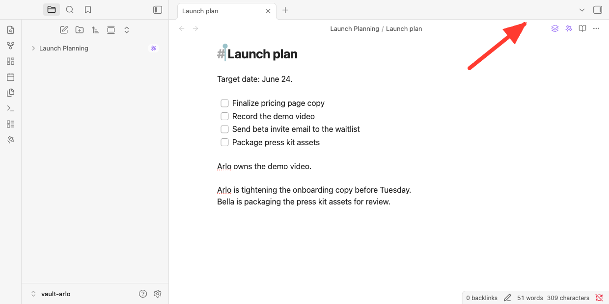
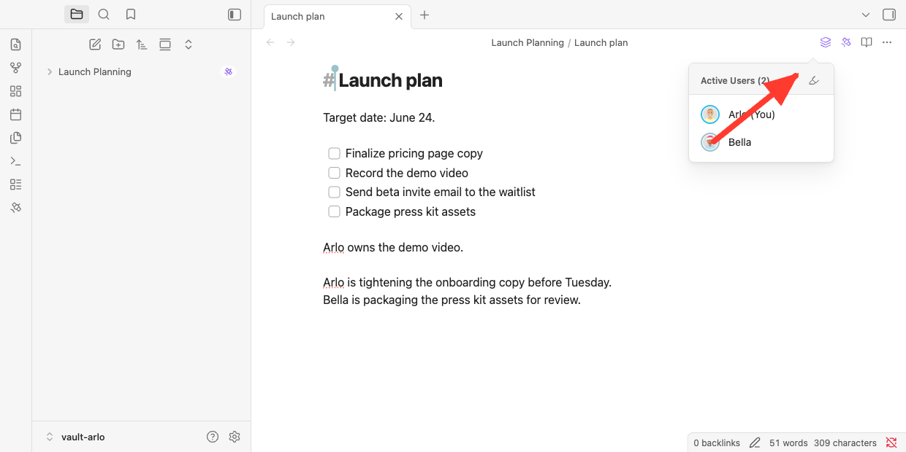
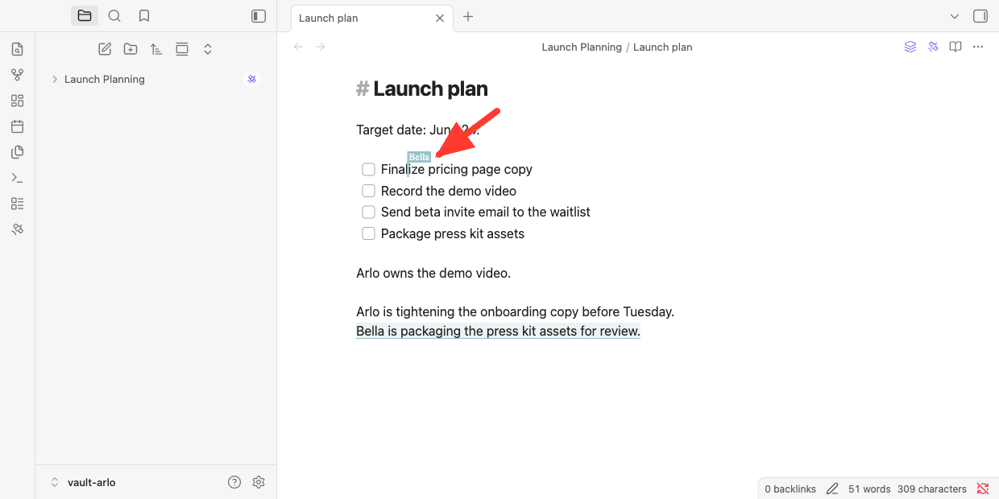
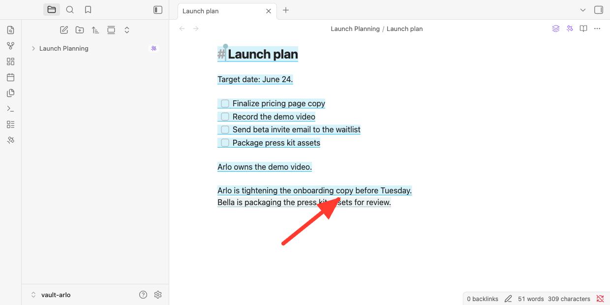
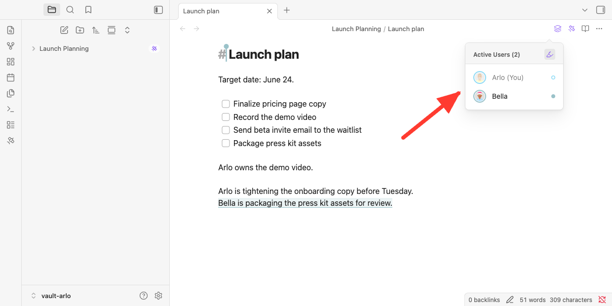

When you open a Shared Folder document with other people, Relay shows who is there with you.

User avatars are presence indicators: they tell you, before you start editing, who else is in the document right now.

## What you see

Relay shows a small stack of avatars in shared documents.

If a person has a profile photo, Relay uses it. If not, Relay shows their initial with a color. Click the avatar stack to open the `Active Users` popover.

The popover shows everyone Relay currently sees in the document, including you. Your own row is marked `(You)`.

If more people are present than fit in the stack, Relay shows a `+N` indicator for the additional users.

## In Markdown notes

In a shared Markdown note, the avatar stack appears near the note title.

Avatars are separate from live cursors: cursors show where people are editing, avatars show who is present.

## Highlight text by author

In Markdown notes, Relay can highlight text by author.

Open the avatar stack, then click the highlighter button in the `Active Users` popover. Relay colors attributable text by author.

To focus on one person's contributions, click that person in the `Active Users` list.

If you prefer the command palette, use:

- `Relay: Enable user attribution highlighting`
- `Relay: Disable user attribution highlighting`

Author highlighting is for understanding existing Markdown text. It is not comments, suggestions, or edit history.

## Where the controls live

Avatars appear automatically when Relay can see active users in the same shared document.

There is no separate avatar switch in Relay settings. Relay uses the name and profile photo from the account you use to sign in. In Relay settings, the `Account` section shows the account currently signed in.

Author highlighting controls live in two places:

- the `Active Users` popover on Markdown notes
- the Obsidian command palette

## If avatars do not appear

Check these first:

1. Make sure the note is inside a Relay Shared Folder.
2. Make sure Relay is connected. See [Understanding Relay's UI icons](/user-interface/icons/) if you are not sure.
3. Make sure the other person has the same document open.
4. Update Relay if you are on an older plugin version. See [Update Relay](/guides/update-relay/).

If you see initials instead of a photo, the person may not have a profile photo available from their sign-in provider.

<!--
Draft status notes (2026-06-10):
- Five harness screenshots embedded above (relative paths render in Obsidian review; rewrite to /assets/user-avatars/... at draft→src promotion, and move assets to src/assets/user-avatars/).
- Canvas section REMOVED per Matt 2026-06-10: "there is no canvas presence. not working yet." Harness confirmed (awareness stayed owner-only with both providers synced). Re-add when relay-plugin confirms working Canvas presence.
- +N overflow shot skipped: needs >2 users; optional later.
-->
